# cjc-frontend

In this project I wanted to create a web app whos purpose is to serve as a tool for lawyers in order to increase their
potential revenue.  
The app was deigned for romanian user -> therefore romanian language used in the demo  
@TODO add internationalisation    
The flow of the application goes like this :  
1. After visiting the landing page where the user will find out details about the  
 services that are being provided by the lawyer they are given proper explanation about the whole process
 they can leave a question through a form which is meant to give the lawyer a small insight about their potential client problem.

"Landing Page"
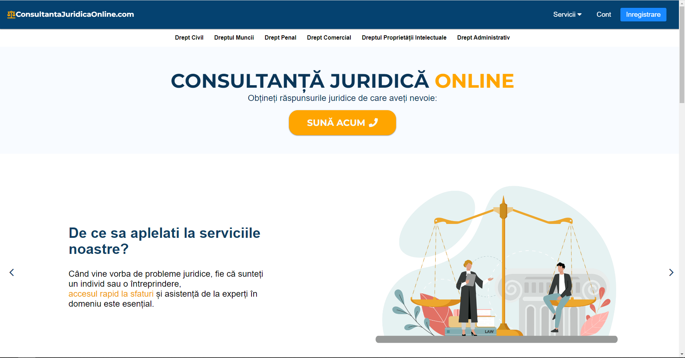

"Add question Form"
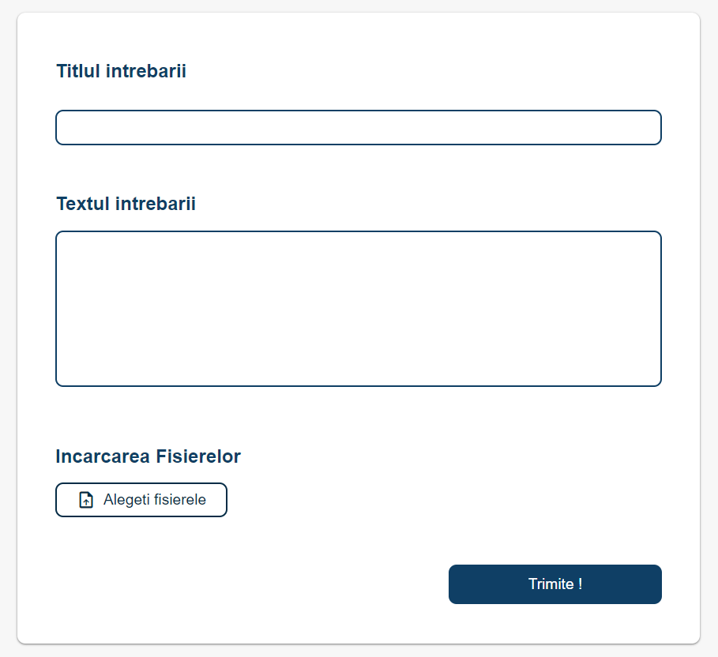
- the user can enter a title .
- the second field represents the question itself.
- the user has the option to add suggestive files that might help the lawyer better understand the situation.  

"Mobile View"  

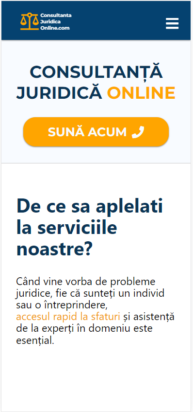

2. After leaving a question the lawyer might choose whether to accept it or not, depending on its expertise .

"Lawyer View of the questions"
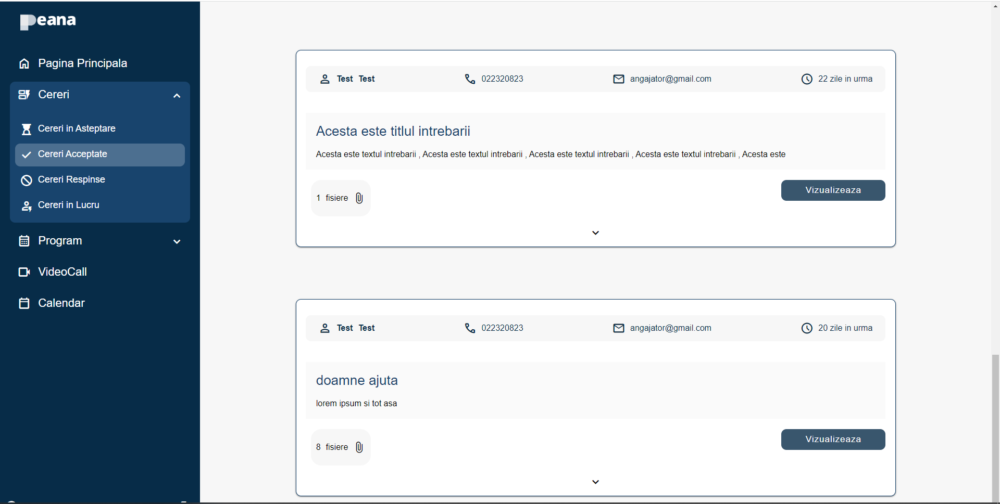

As you can see the view is composed of a sidebar in which the lawyer can choose between Waiting Questions,  
Accepted Questions, Rejected Questions and Working Cases.  
A question might be accepted or not, if accepted the user is notified and the next step is to choose a time to hold a videocall  
with the lawyer.  

When Choosing whether the question should be accepted or not, the lawyer can see the sent files in order to gain a better  
perspective about the case itself.
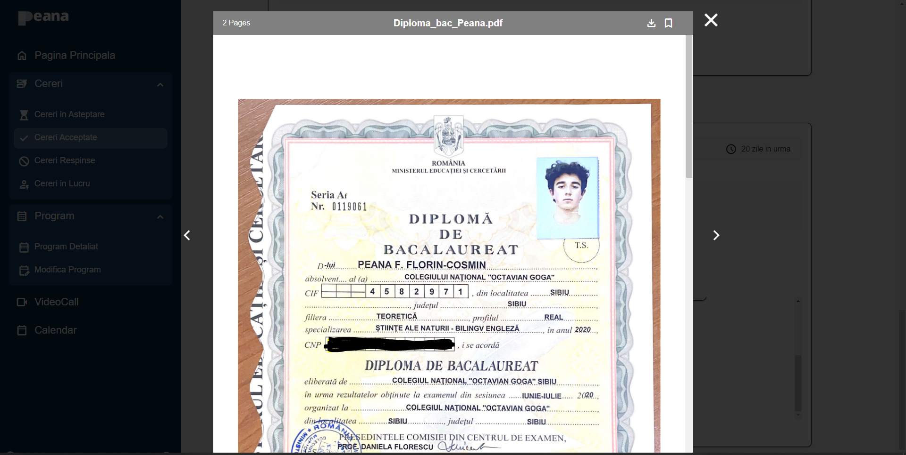

By clicking on the buttons the question will be accepted or rejected.
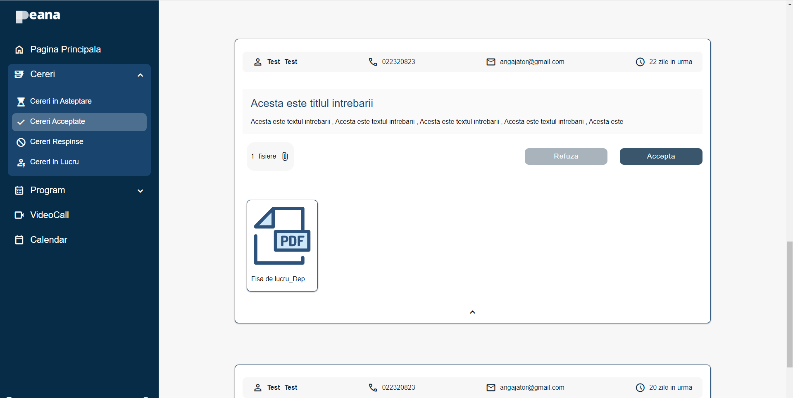

3. In case of an accepted question the user will have the option to choose when to make an appointment

"This is a proof of concept about what the user should see, it looks pretty ugly"
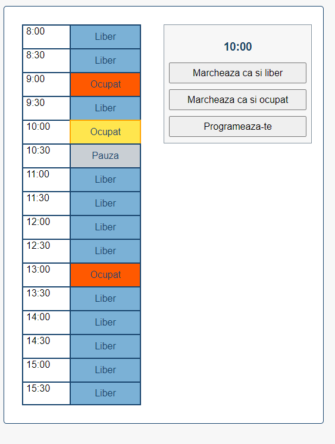

"In case of an appointment being made the lawyer can see a full schedule of their clients appointments"
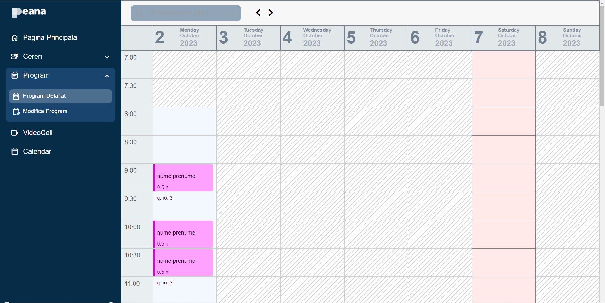

@TODO Create Context Menu for marking a time slot as free or not :  
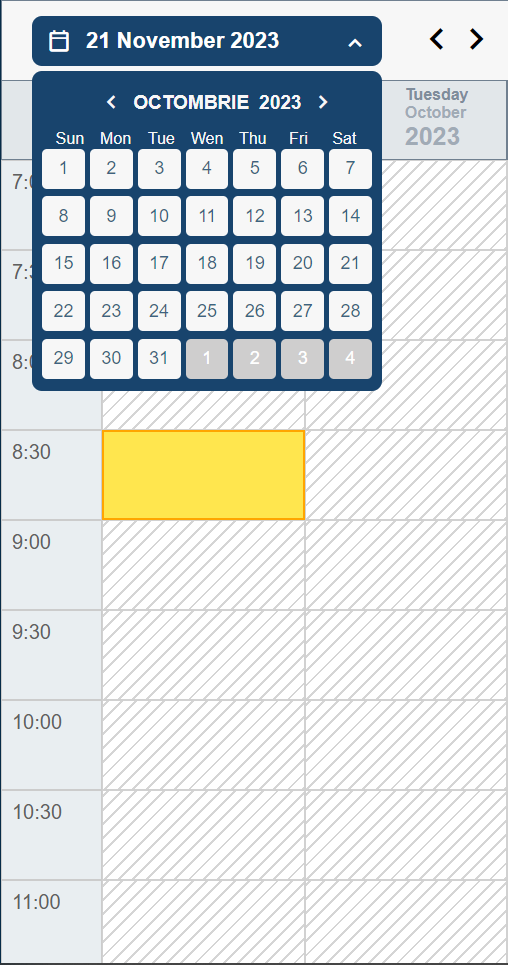

4. The consultation itself is supposed to be taking place on the designated VideoCall component:

"Web view of VideoCall"
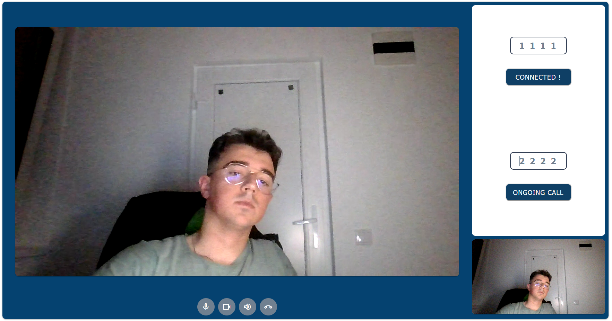

"Mobile View"  
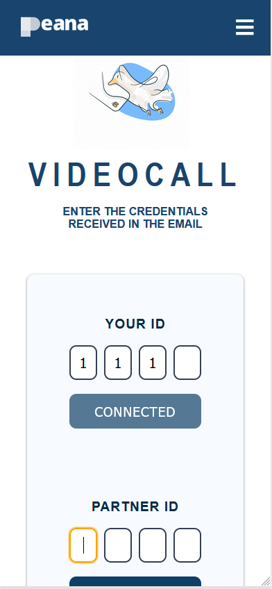
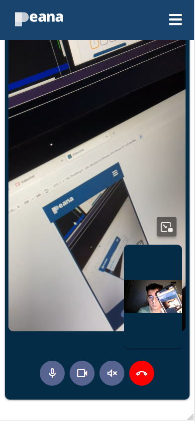
